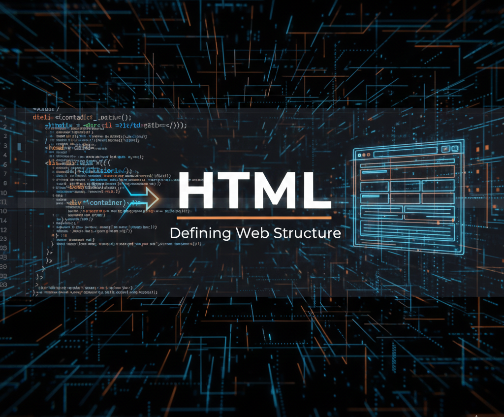

<div align="center">



<h1>🌐 HTML Learning Project — Mastering Web Development Fundamentals</h1>

<p style="color: #2563eb; margin: 15px 0; font-size: 1.1em;">🚀 A comprehensive HTML learning project featuring practical examples of web development fundamentals including headings, formatting, colors, and styling. This repository demonstrates core HTML concepts with clean, semantic markup and modern CSS styling techniques for building responsive web applications.</p>

<p style="font-size: 1.2em; color: #1e40af; background: linear-gradient(135deg, #dbeafe 0%, #bfdbfe 100%); padding: 20px; border-radius: 12px; max-width: 800px; margin: 20px auto; line-height: 1.6; border-left: 4px solid #2563eb;">
🎯 <b>6 HTML Pages</b> with examples | ⚡ <b>Modern CSS</b> styling | 🌐 <b>Responsive Design</b> | 📱 <b>Mobile-First</b> approach
</p>

<p align="center">
  
  
  
  
  
</p>

</div>

---

## 📁 Project Structure

```
HTML/
├── 📄 index.html                   # Main landing page
├── 📄 heading.html                 # HTML heading examples (h1-h6)
├── 📄 formating.html               # Text formatting demonstrations
├── 📄 colors.html                  # Color styling examples
├── 📄 linktags.html                # HTML link tags examples
├── 📄 style.css                    # Global stylesheet
├── 📂 assets/                      # Project assets
│   ├── 🖼️ HTML.png                 # Project banner image
│   └── 🖼️ Image.png                # Additional project image
├── 📂 PCS-693/                     # Lab practice examples
│   ├── 📄 P1.html                  # Practice example 1
│   ├── 📄 P2.html                  # Practice example 2
│   ├── 📄 P3.html                  # Practice example 3
│   ├── 📄 P4.html                  # Practice example 4
│   ├── 📄 P5.html                  # Practice example 5
│   ├── 📄 P6.html                  # Practice example 6
│   ├── 📄 P7.html                  # Practice example 7
│   ├── 📄 P8.html                  # Practice example 8
│   ├── 📄 P9.html                  # Practice example 9
│   ├── 📄 P10.html                 # Practice example 10
│   ├── 📄 P11.html                 # Practice example 11
│   ├── 📄 P12.html                 # Practice example 12
│   ├── 📄 P13.html                 # Practice example 13
│   ├── 📄 P14.html                 # Practice example 14
│   ├── 📄 P15.html                 # Practice example 15
│   ├── 📄 P16.html                 # Practice example 16
│   ├── 📄 P17.html                 # Practice example 17
│   └── 📄 FSWD Lab Manual.pdf      # Lab manual documentation
├── 📄 README.md                    # Project documentation
├── 📄 LICENSE                      # MIT License
└── 📄 .gitignore                   # Git ignore patterns
```

---

## 🎯 Learning Objectives

<div align="center">

| 📚 Topic | 📄 File | 🎯 Learning Goal |
|----------|---------|------------------|
| **HTML Structure** | [index.html](index.html) | Document structure, semantic HTML |
| **Headings** | [heading.html](heading.html) | H1-H6 hierarchy, accessibility |
| **Text Formatting** | [formating.html](formating.html) | Bold, italic, underline, emphasis |
| **Colors & Styling** | [colors.html](colors.html) | CSS colors, backgrounds, themes |
| **Link Tags** | [linktags.html](linktags.html) | HTML links, navigation, anchors |
| **CSS Fundamentals** | [style.css](style.css) | Selectors, properties, responsive design |

</div>

---

## 🚀 Getting Started

### 📋 Prerequisites

- 🌐 Modern web browser (Chrome, Firefox, Safari, Edge)
- 📝 Text editor (VS Code, Sublime Text, or any IDE)
- 💻 Basic understanding of web development concepts

### 🔧 Setup Instructions

```bash
# Clone or download the project
git clone https://github.com/AbhishekGiri04/html-studio.git

# Navigate to the HTML folder
cd HTML

# Open in your preferred browser
open index.html
# OR
python -m http.server 8000  # For local server
```

### 🌐 Live Preview

Simply open any HTML file in your web browser:

- **Main Page**: [index.html](index.html)
- **Headings Demo**: [heading.html](heading.html)
- **Formatting Examples**: [formating.html](formating.html)
- **Color Showcase**: [colors.html](colors.html)
- **Link Tags Demo**: [linktags.html](linktags.html)

---

## 📖 File Descriptions

### 🏠 [index.html](index.html)
The main landing page that serves as the entry point to the project. Features navigation links to all other pages and provides an overview of the learning content.

### 📝 [heading.html](heading.html)
Demonstrates HTML heading hierarchy from H1 to H6, showcasing proper semantic structure and accessibility best practices for web content organization.

### ✨ [formating.html](formating.html)
Comprehensive examples of HTML text formatting including:
- **Bold** and *italic* text
- Underlined content
- Emphasis and strong importance
- Subscript and superscript
- Code formatting

### 🎨 [colors.html](colors.html)
Visual showcase of CSS color implementations:
- Named colors
- Hex color codes
- RGB and RGBA values
- Background colors
- Text color variations

### 🔗 [linktags.html](linktags.html)
Comprehensive examples of HTML link elements:
- Internal and external links
- Navigation menus
- Anchor links
- Link styling and states
- Best practices for accessibility

### 🎨 [style.css](style.css)
Global stylesheet containing:
- Reset and normalize styles
- Typography definitions
- Color schemes
- Responsive design rules
- Modern CSS techniques

---

## 🛠️ Technologies Used

<div align="center">

<table>
<thead>
<tr>
<th>🖥️ Technology</th>
<th>⚙️ Purpose</th>
<th>📊 Usage</th>
</tr>
</thead>
<tbody>
<tr>
<td></td>
<td>Markup structure and content</td>
<td>Document structure, semantic elements</td>
</tr>
<tr>
<td></td>
<td>Styling and visual presentation</td>
<td>Colors, typography, layout, responsiveness</td>
</tr>
</tbody>
</table>

</div>

---

## 🎓 Learning Outcomes

After exploring this project, you will understand:

✅ **HTML Document Structure** - Proper HTML5 semantic markup  
✅ **Heading Hierarchy** - SEO-friendly content organization  
✅ **Text Formatting** - Various ways to style and emphasize content  
✅ **Color Theory** - Different methods to apply colors in web design  
✅ **CSS Fundamentals** - Styling techniques and best practices  
✅ **Responsive Design** - Mobile-first approach to web development  
✅ **Web Standards** - Modern HTML5 and CSS3 specifications  
✅ **Accessibility** - Creating inclusive web content

---

## 🌟 Key Features

- **📱 Responsive Design** - Works on all device sizes
- **🎨 Modern Styling** - Clean, professional appearance
- **♿ Accessibility** - Semantic HTML for screen readers
- **🚀 Fast Loading** - Optimized assets and minimal code
- **📚 Educational** - Clear examples with comments
- **🔧 Modular** - Separate files for different concepts

---

## 🤝 Contributing

This is a learning project, but contributions are welcome! Feel free to:

- 🐛 Report bugs or issues
- 💡 Suggest improvements
- 📝 Add more examples
- 🎨 Enhance styling
- 📖 Improve documentation

---

## 📞 Contact & Support

<div align="center">

> 💬 *Questions about this HTML learning project?*  
> Feel free to reach out for help or collaboration!

<br/>

**👤 Abhishek Giri** - Project Creator

<a href="https://linkedin.com/in/abhishek-giri04">
  
</a>  
<a href="https://github.com/abhishekgiri04">
  
</a>  
<a href="mailto:abhishekgiri.dev@gmail.com">
  
</a>

</div>

---

<div align="center">

## 📄 License

This project is open source and available under the **MIT License** - see the [LICENSE](LICENSE) file for details.

---

**🚀 Built with ❤️ for Learning Web Development**  
*Mastering HTML & CSS Fundamentals*

<p style="font-size: 1.1em; color: #1e40af; margin: 20px 0;">
<b>HTML Learning Project</b> — Web Development Fundamentals<br/>
<em>Building strong foundations in modern web development</em>
</p>

---

**© 2026 Abhishek Giri | HTML Learning Project**

*Empowering developers with practical web development skills*


</div>